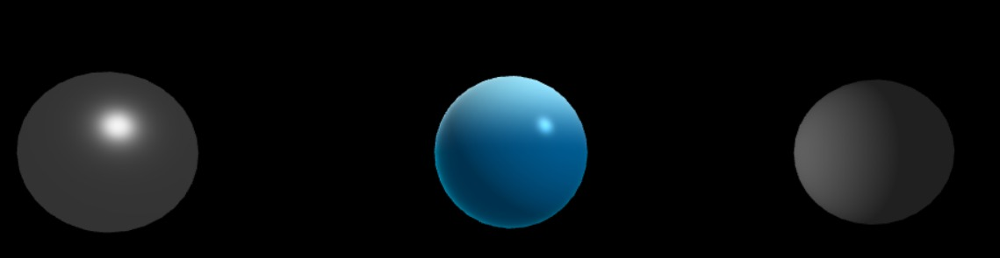

# PC2 - Computación Gráfica

Este proyecto implementa tres esferas 3D con diferentes materiales: metálico, agua y opaco, utilizando OpenGL y Pygame.

### Ejecución
```bash
python main.py
```

### Output
